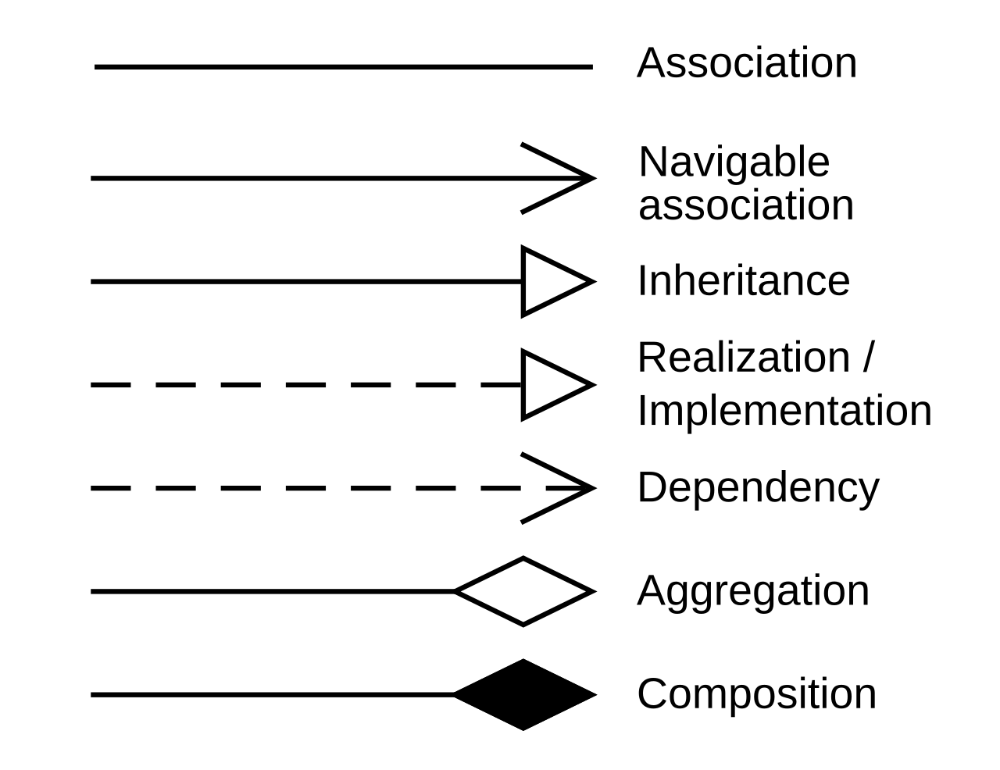

# Хранение онтологий
Онтологии хранятся в графовой БД neo4j.

## Узлы
Узлы (nodes) имеют тип `Class`. Каждый узел имеет следующие свойства:
* `domain` - область, в онтологию которой входит данный узел. *Так осуществляется обход невозможности создавать несколько БД в свободной версии neo4j.*
* `name` - имя класса.
* `modifiers` - массив модификаторов сущности. Может содержать следующие значения:
    + `abstract` - абстрактный класс (в UML соответствует курсиву)
    + `object` - объект (в UML соответствует подчёркиванию)

Пример команды добавления узла:
```cypher
CREATE (с:Class {name: "Пустое множество", domain: "Наивная теория множеств", modifiers: ["object"]})
```

## Отношения
Отношения (relations) могут иметь следующие типы:
* `Association`
* `Inheritance`
* `Realization`
* `Dependency`
* `Aggregation`
* `Composition`
* `Instance` - отношение между объектом и типом
* `Manifest` - отношение между "идеей" и её воплощением

Соответствие типов отношений диаграммы классов к графической нотации UML:


### Свойства отношений
Любое отношение может иметь свойства для записи параметров полюсов:
* `name*` - имя полюса
* `multiplicity*` - кратность
* `others*` - остальные параметры

Вместо `*` должен стоять либо `1`, либо `2`, для первого и второго соответственно полюсу. *Такая структура связана с невозможностью иметь многоуровневые свойства. В neo4j свойства могут быть только примитивами и массивами.*

Ассоциация (`Association`) обязана иметь 2 свойства:
+ `predicate` - сказуемое, если первый полюс подлежащее, а второе - дополнение
+ `predicateInv` - сказуемое, если первый полюс дополнение, а второе - подлежащее

### Пример команды добавления отношения
На момент создания отношения уже должны быть созданы узлы, которые оно соединяет.
```cypher
MATCH (c1:Class {name: "Элемент множества"}), (c2:Class {name: "Множество"}) MERGE (c1)-[r:Aggregation {multiplicity1: "*"}]-(c2)
```
